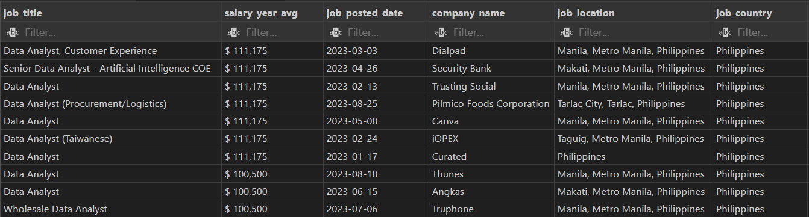
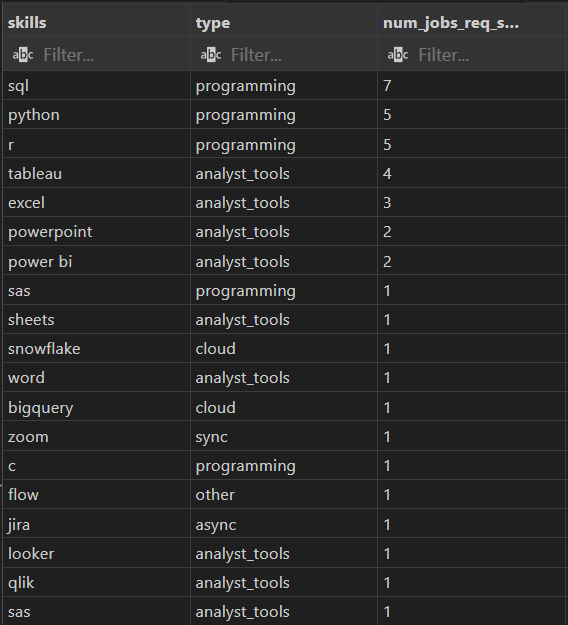
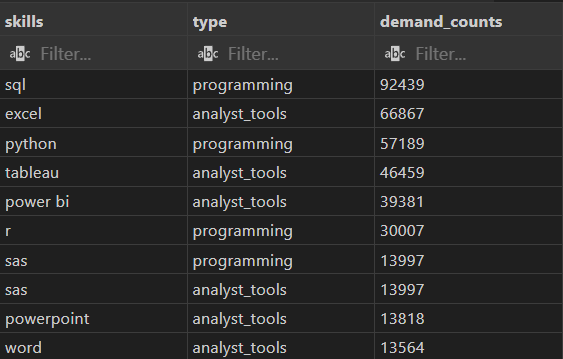
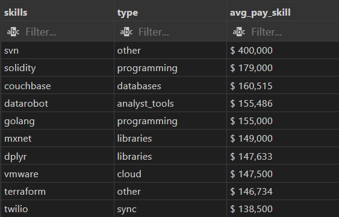
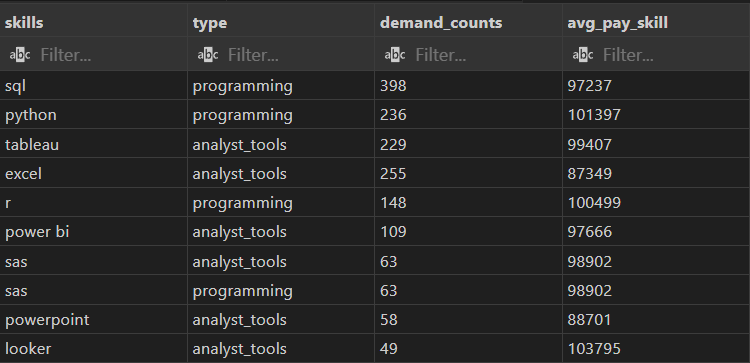

# Introduction

Globally, the demand for Data Analysts continues to rise as organizations depend on data insights to stay competitive. The same trend is evident in the Philippines, where companies are increasingly adopting analytics to improve decision making and understand consumer behavior. As a job seeker, this study helps me examine Data Analyst job postings in 2023 and identify key skills, opportunities, and salary trends in the Philippine market.

# Background

The COVID-19 pandemic accelerated global digital adoption, driving a surge in online activity and a significant rise in data generation. As industries in the Philippines adapted to this shift, the need for data-driven decision making grew, reinforcing the importance of Data Analysts in the post-pandemic workforce.

As a job seeker, this study helps me understand the Philippine landscape by identifying the top paying Data Analyst roles in 2023 and the skills they require. It also considers global trends to determine which analytics skills are most in demand and offer the highest earning potential worldwide.


### The questions I wanted to answer through my SQL query were:

1. <p align="justify">What are the top-paying data analyst job posted in AI-jobs.net located in the Philippines in 2023?
2. <p align="justify">What are the skills of the top-paying data analyst job posted in AI-jobs.net located in the Philippines in 2023?
3. <p align="justify">What are the top in demand skills for data analyst in 2023?
4. <p align="justify">What are the top paying skills for data analyst in 2023?
5. <p align="justify">What is the most optimal skills to learn? Both highest paying and in demand skill.

# Tools/Tech Stack
- **SQL** – The primary query language used to retrieve, filter, and analyze data from the database.

- **PostgreSQL** – The relational database management system (RDBMS) used to store, process, and manage the dataset.

- **pgAdmin** – The graphical user interface (GUI) tool used to access and manage the PostgreSQL database and execute SQL queries.

- **Visual Studio Code (VS Code)** – Used as the main editor for writing SQL scripts and organizing project files.

- **Git & GitHub** – Used for version control to track changes and maintain version history throughout the project.

# The Analysis


#### 1. What are the top-paying data analyst job posted in AI-jobs.net located in the Philippines in 2023?

I first identified the highest-paying Data Analyst roles posted in AI-jobs.net for 2023. The query filters job titles containing both “Data” and “Analyst”, focuses on postings located in the Philippines, and sorts them by annual salary.

```sql
SELECT 
    job_title, 
    TO_CHAR(salary_year_avg, '$999,999,999') AS salary_year_avg,
    job_posted_date::DATE AS job_posted_date,
    company_dim.name AS company_name,  
    job_location, 
    job_country
FROM
    job_postings_fact
LEFT JOIN company_dim ON company_dim.company_id = job_postings_fact.company_id 
WHERE
    job_title LIKE '%Data%'
    AND job_title LIKE '%Analyst%'
    AND job_country = 'Philippines' 
    AND salary_year_avg IS NOT NULL
ORDER BY
    salary_year_avg DESC
LIMIT 10;
```
**Output:**



This establishes the benchmark for top-tier salaries and highlights which companies and job positions offer the most competitive compensation in the country.


- Contains data analyst job postings in the Philippines, mostly in Metro Manila (Makati, Manila, Taguig) with a few in other cities like Tarlac.

- Salaries range from $100,500 to $111,175/year.

- Job titles vary slightly (e.g., “Senior Data Analyst - AI COE”, “Data Analyst (Procurement/Logistics)”) but most are simply “Data Analyst”.

- Companies include a mix of local banks, tech companies, and global firms with Philippine offices (e.g., Security Bank, Canva, Angkas).

- Useful for understanding local salary levels, popular roles, and active employers.

#### 2. What are the skills of the top-paying data analyst job posted in AI-jobs.net located in the Philippines in 2023?

After identifying the top-paying roles, I examined the skills associated with those same job IDs. This reveals which technical and analytical skills are most valued by employers offering the highest salaries.

```sql
WITH top_paying_job AS (
SELECT
    job_id,
    job_title, 
    TO_CHAR(salary_year_avg, '$999,999,999') AS salary_year_avg,
    job_posted_date::DATE AS job_posted_date,
    company_dim.name AS company_name,  
    job_location, 
    job_country
FROM
    job_postings_fact
LEFT JOIN company_dim ON company_dim.company_id = job_postings_fact.company_id 
WHERE
    job_title LIKE '%Data%'
    AND job_title LIKE '%Analyst%'
    AND job_country = 'Philippines' 
    AND salary_year_avg IS NOT NULL
ORDER BY
    salary_year_avg DESC
LIMIT 10)

SELECT
    skills,
    type,
    COUNT(skills) AS num_jobs_req_skills
FROM 
    top_paying_job
    JOIN 
        skills_job_dim ON top_paying_job.job_id = skills_job_dim.job_id
    JOIN 
        skills_dim ON skills_job_dim.skill_id = skills_dim.skill_id
GROUP BY 
    skills, type
ORDER BY 
    COUNT(skills) DESC
;
```
**Output:**



This step shows the specific tools and programming languages that consistently appear among the highest-paying positions, giving insight into what skills employers consider essential at the top salary level.

- Lists which skills are required across a sample of Philippine job postings.

- Most requested: SQL (7 jobs), followed by Python and R (5 jobs each).

- Analyst tools like Tableau (4), Excel (3), PowerPoint (2), Power BI (2) also appear.

- Less common skills (e.g., Jira, Zoom, Flow) appear in only 1 job each.

- Gives insight into what skills recruiters prioritize locally.

#### 3. What are the top in demand skills for data analyst in 2023?

To understand overall demand, I counted how often each skill appeared in all global Data Analyst postings in 2023. This identifies the skills that companies request most frequently.

```sql
WITH data_analyst_job AS (
SELECT 
    *
FROM
    job_postings_fact
WHERE
    job_title_short = 'Data Analyst'
    AND EXTRACT(YEAR FROM job_posted_date) = 2023
)

SELECT
    skills, type, COUNT(skills) AS demand_counts
FROM 
    data_analyst_job 
    JOIN skills_job_dim ON skills_job_dim.job_id = data_analyst_job.job_id
    JOIN skills_dim ON skills_dim.skill_id = skills_job_dim.skill_id
GROUP BY 
    skills, type
ORDER BY 
    COUNT(skills) DESC
LIMIT 10;
```
**Output:**



This ranking highlights the foundational skills every aspiring Data Analyst should prioritize.

- Shows how many global job postings mention each skill.

- Most in-demand globally: SQL (92,439 postings), Excel (66,867), Python (57,189), Tableau (46,459), Power BI (39,381).

- Highlights which skills are widely requested worldwide, giving a benchmark for local skill relevance.

#### 4. What are the top paying skills for data analyst in 2023?

Next, I calculated the average salary associated with each skill across all job postings. This identifies which skills tend to correspond with higher compensation.
```sql
WITH data_analyst_job AS (
SELECT 
    *
FROM
    job_postings_fact
WHERE
    job_title_short = 'Data Analyst'
    AND EXTRACT(YEAR FROM job_posted_date) = 2023
    AND salary_year_avg IS NOT NULL
)

SELECT
    skills, type, TO_CHAR(ROUND(AVG(salary_year_avg), 0), '$999,999,999') AS avg_pay_skill
FROM 
    data_analyst_job 
    JOIN skills_job_dim ON skills_job_dim.job_id = data_analyst_job.job_id
    JOIN skills_dim ON skills_dim.skill_id = skills_job_dim.skill_id
GROUP BY 
    skills, type
ORDER BY 
    avg_pay_skill DESC
LIMIT 10
;
```
**Output:**



This reveals which specialized or advanced skills provide the strongest salary advantage.

- Provides average global salaries for jobs requiring each skill.

- Highest-paying skills include SVN ($400,000), Solidity ($179,000), and Couchbase ($160,515).

- Analyst and cloud tools generally range $138k–$155k.

- Useful to identify high-value skills and niche specializations in the global market.

#### 5. What is the most optimal skills to learn? Both highest paying and in demand skill.

Finally, I combined the most in-demand skills and highest-paying skills to determine which skills score highly in both categories. Ranking them using a combined metric (demand × average salary) identifies the most optimal skills for a job seeker to learn.

```sql
WITH data_analyst_job AS (
SELECT 
    *
FROM
    job_postings_fact
WHERE
    job_title_short = 'Data Analyst'
    AND EXTRACT(YEAR FROM job_posted_date) = 2023
    AND salary_year_avg IS NOT NULL
    AND job_work_from_home =TRUE

),

in_demand_skill AS (
SELECT
    skills_dim.skill_id, skills_dim.skills, skills_dim.type, COUNT(skills) AS demand_counts
FROM 
    data_analyst_job 
    JOIN skills_job_dim ON skills_job_dim.job_id = data_analyst_job.job_id
    JOIN skills_dim ON skills_dim.skill_id = skills_job_dim.skill_id
GROUP BY 
    skills_dim.skill_id, skills_dim.skills, skills_dim.type
ORDER BY 
    COUNT(skills) DESC
),

highest_paying_skill AS (
SELECT
    skills_dim.skill_id, skills_dim.skills, skills_dim.type, ROUND(AVG(salary_year_avg), 0) AS avg_pay_skill
FROM 
    data_analyst_job 
    JOIN skills_job_dim ON skills_job_dim.job_id = data_analyst_job.job_id
    JOIN skills_dim ON skills_dim.skill_id = skills_job_dim.skill_id
GROUP BY 
    skills_dim.skill_id, skills_dim.skills, skills_dim.type
ORDER BY 
    avg_pay_skill DESC
)

SELECT 
    highest_paying_skill.skills, highest_paying_skill.type
    FROM in_demand_skill
    JOIN highest_paying_skill ON highest_paying_skill.skill_id = in_demand_skill.skill_id
ORDER BY 
    (demand_counts * avg_pay_skill) DESC
LIMIT 10
;
```
**Output:**



This step highlights the skills that offer the best balance of competitiveness and earning potential.

- Combines global skill demand and average pay into one table.

- Examples:

    - **SQL**: 398 jobs, $97,237 average pay → top skill to learn due to high demand × pay.

    - **Python**: 236 jobs, $101,397 average pay

    - **Tableau and Excel** → slightly lower demand but still strong in both metrics.

- Helps compare which skills are both in demand and well-paid, useful for strategic skill development.

# What I learned

As a job seeker, analyzing the Philippine data taught me that the country’s top-paying Data Analyst roles in 2023 offered salaries of $111,175, and these positions appeared across companies like Security Bank, Dialpad, Canva, Trusting Social, and iOPEX. Even though the results were limited to only the top 10 highest-paying roles, the skill requirements already showed a clear pattern: SQL appeared the most (7 occurrences), followed by Python and R (each 5 occurrences) as well as tools like Tableau (4) and Excel (3). This means that in the Philippines, even at the highest salary tier, employers still prioritize strong core analytical and programming foundations.

From the global range, I learned that the trend was still clear: skills like SQL, Excel, Python, Tableau, and Power BI consistently appeared at the top of the “most in-demand” lists. For the highest-paying skills, the data showed that specialized or niche technologies such as SVN, Solidity, and Couchbase received the highest average salary values within the limited result set. When both demand and pay were combined, the skills that ranked best were SQL, Python, and Tableau, these skills consistently provide strong balance between demand and compensation.

# Conclusions

From the Philippine results, I concluded that to be competitive locally especially for top-paying roles that I must master the core fundamentals are SQL, Python, R, Tableau, and Excel. These appeared repeatedly even within a small sample of the highest-paying jobs, proving that Philippine employers value strong foundational skills rather than niche technologies.

From the global results, I concluded that while some niche skills can offer extremely high salaries, their demand is not broad based on the limited output available. The skills that consistently appear in both the global “in-demand” list and the global “high-paying” list such as SQL, Python, and Tableau. They represent the most stable and strategic skills for me to prioritize. These skills not only appear frequently even in a limited dataset but also rank highly in salary potential, making them the strongest long-term investment for my career.